<picture>
  <source media="(prefers-color-scheme: dark)" srcset="./assets/hero-dark.svg">
  <source media="(prefers-color-scheme: light)" srcset="./assets/hero-light.svg">
  
</picture>

 

### Hey, I'm Ziad

I build native iOS apps with Swift and SwiftUI. I like small apps with one clear job, done properly: real offline behaviour, widgets that earn their place on the home screen, and no dark patterns at the paywall.

Right now I'm building an app for early risers, and taking on freelance iOS work.

 

### Toolbox

 

### What I'm up to

| | |
|---|---|
| 🌅 | Building a wake-up app for early risers — SwiftUI, AlarmKit, HealthKit |
| 💼 | Open to freelance iOS work |
| 🌱 | Going deep on AlarmKit, Live Activities, and StoreKit 2 |
| 💬 | Ask me about SwiftUI, widgets, or shipping to the App Store |

 

### Stats

  
  

 

### Contribution graph

<picture>
  <source media="(prefers-color-scheme: dark)" srcset="https://raw.githubusercontent.com/Ziad-AlHusseiny/Ziad-AlHusseiny/output/snake-dark.svg">
  <source media="(prefers-color-scheme: light)" srcset="https://raw.githubusercontent.com/Ziad-AlHusseiny/Ziad-AlHusseiny/output/snake.svg">
  
</picture>

 

### Say hello

Open an issue on any repo, or reach me through my GitHub profile.

