<picture>
  <source media="(prefers-color-scheme: dark)" srcset="./assets/hero-dark.svg">
  <source media="(prefers-color-scheme: light)" srcset="./assets/hero-light.svg">
  
</picture>

 

### Stats

<picture>
  <source media="(prefers-color-scheme: dark)" srcset="./assets/stats-dark.svg">
  <source media="(prefers-color-scheme: light)" srcset="./assets/stats-light.svg">
  
</picture>

 

### Contribution graph

<picture>
  <source media="(prefers-color-scheme: dark)" srcset="https://raw.githubusercontent.com/Ziad-AlHusseiny/Ziad-AlHusseiny/output/snake-dark.svg">
  <source media="(prefers-color-scheme: light)" srcset="https://raw.githubusercontent.com/Ziad-AlHusseiny/Ziad-AlHusseiny/output/snake.svg">
  
</picture>

 

### Say hello

Open an issue on any repo, or reach me through my GitHub profile.

